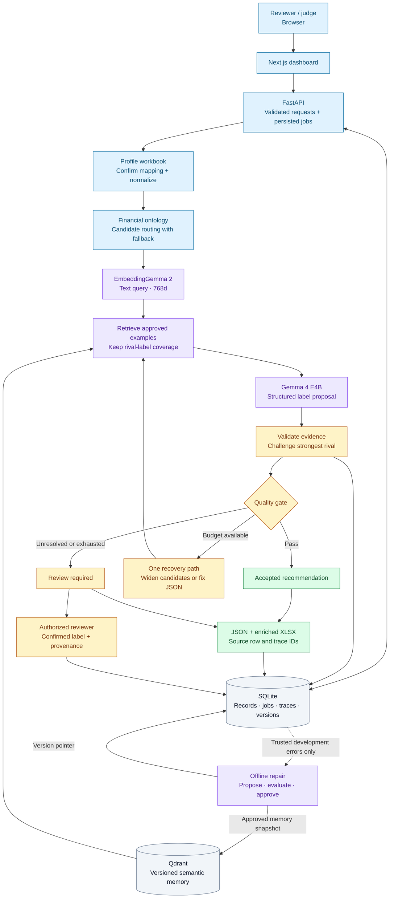
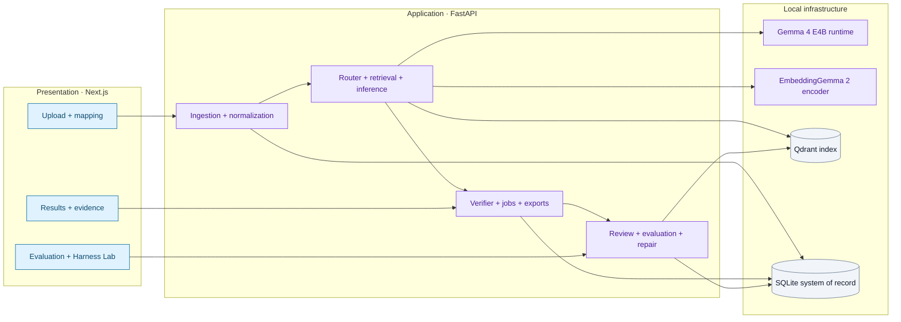
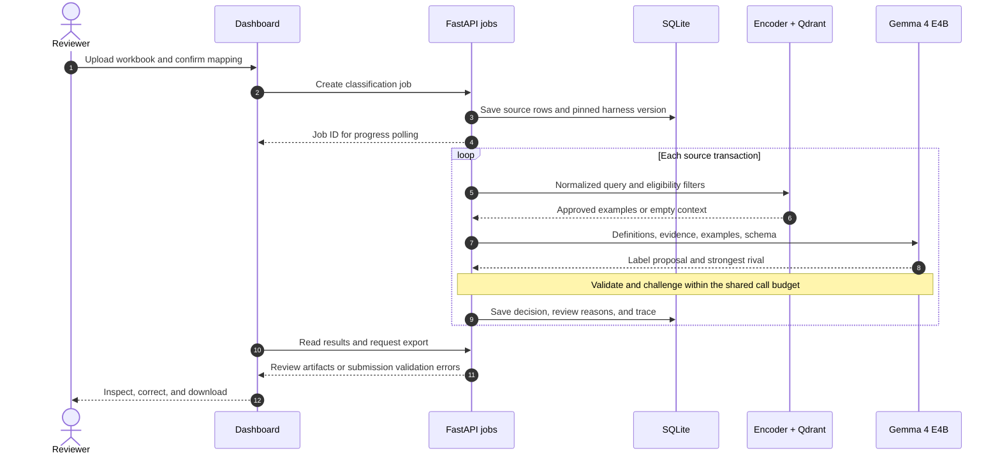
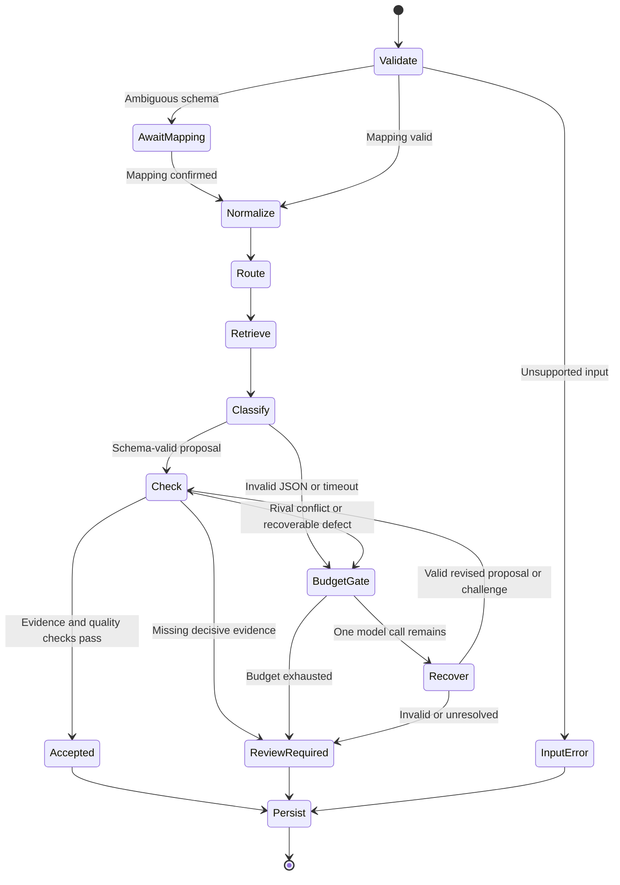
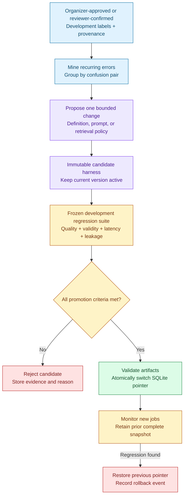
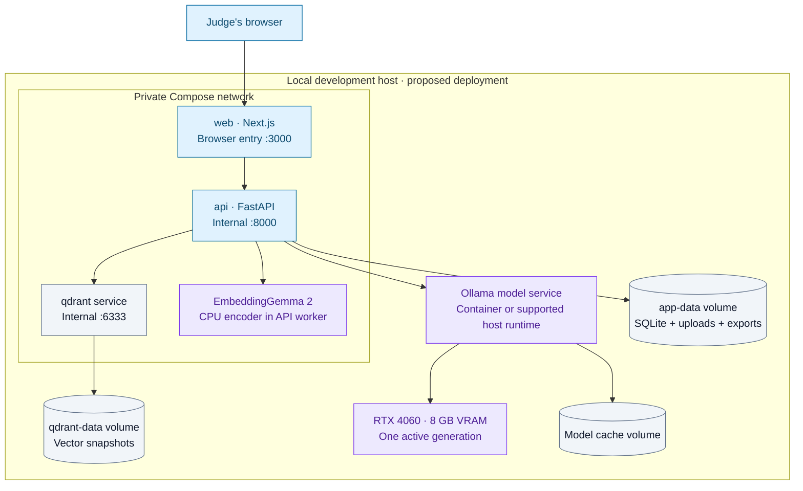

<div align="center">

#  Hacktoberfest 2k26 · Team Demons 
###  PS4 — VYOM+ Intelligent Voucher Classification Using Open-Source LLMs

[](#)
[](#)
[](#)
[](#)

<br/><br/>

<table>
  <thead>
    <tr align="center">
      <th width="200"> Role</th>
      <th width="320"> Member Name</th>
      <th width="240"> Scholar ID / Roll No</th>
    </tr>
  </thead>
  <tbody>
    <tr align="center">
      <td>
        <h3 style="margin: 4px 0;"> <b>TEAM LEAD</b></h3>
      </td>
      <td>
        <h2 style="margin: 4px 0;"><ins><b>Vinay Kumrawat</b></ins></h2>
      </td>
      <td>
        <h3 style="margin: 4px 0;"><code>BT25CSE159</code></h3>
      </td>
    </tr>
    <tr align="center">
      <td>
        <b>Team Member</b>
      </td>
      <td>
        <b>Adinath Patil</b>
      </td>
      <td>
        <code>BT25CSA067</code>
      </td>
    </tr>
  </tbody>
</table>

<br/>

---

# HisabhParakh

### Voucher Classification with Adaptive Reasoning & Error Recovery

**Understand the transaction. Explain the voucher. Improve from verified mistakes.**

**PS4 — VYOM+ Intelligent Voucher Classification Using Open-Source LLMs**

**Team Demons · Hacktoberfest 2k26 · Proposed solution**

[The problem](#2-problem-statement) · [Architecture](#10-system-architecture) · [Adaptive workflow](#13-agentic-workflow-if-applicable) · [Expected output](#17-expected-final-output) · [Evidence](#research-evidence)

</div>

**Implementation update — 10 October 2026:** P01 now provides a runnable local
FastAPI service, SQLite migrations and a Next.js service-readiness UI. P00's
Gemma smoke passed; embeddings remain pending. Workbook upload/classification
are next phases. See the [runbook](docs/runbook.md) and
[implementation status](docs/implementation-status.md) for tested commands and
evidence. The solution sections below describe the broader target architecture.

---

## Executive summary

**HisabhParakh is a proposed local AI assistant that turns structured Excel transactions into traceable voucher recommendations.** It combines financial rules, relevant verified examples, and **Gemma 4 E4B** to distinguish transactions that look similar but belong to different voucher categories. Each recommendation carries source evidence, a competing explanation, and an explicit acceptance or review state.

The intended benefit is practical: accounting reviewers can focus on ambiguous records while inspecting the evidence behind routine suggestions. When a reviewer confirms a mistake, HisabhParakh can propose a narrow change to its classification instructions, test that change, and retain it only if the evaluation supports it.


*Proposed user journey. Detailed diagrams below show execution, storage, recovery, and deployment.*


## Contents

| Challenge and solution | AI and architecture | Delivery and feasibility |
|---|---|---|
| [1. Project Name](#1-project-name) | [7. Open-Source AI Technology Selected](#7-open-source-ai-technology-selected) | [14. Technology Stack](#14-technology-stack) |
| [2. Problem Statement](#2-problem-statement) | [8. Why This Technology Was Selected](#8-why-this-technology-was-selected) | [15. Expected Features](#15-expected-features) |
| [3. Project Overview](#3-project-overview) | [9. AI's Role in the System](#9-ais-role-in-the-system) | [16. Implementation Approach](#16-implementation-approach) |
| [4. Proposed Solution](#4-proposed-solution) | [10. System Architecture](#10-system-architecture) | [17. Expected Final Output](#17-expected-final-output) |
| [5. Objectives](#5-objectives) | [11. Component-Level Architecture](#11-component-level-architecture) | [18. Future Scope / Scalability](#18-future-scope--scalability) |
| [6. Target Users / Use Case](#6-target-users--use-case) | [12. Data / Information Flow](#12-data--information-flow) | [19. Open-Source Dependencies / Components](#19-open-source-dependencies--components) |
| [Executive summary](#executive-summary) | [13. Agentic Workflow](#13-agentic-workflow-if-applicable) | [20. Expected Challenges and Mitigation](#20-expected-challenges-and-mitigation) |

**Supporting evidence:** [Research](#research-evidence) · [Evaluation](#evaluation-and-scientific-validation-protocol) · [Judge demonstration](#judge-demonstration-narrative) · [Configuration and first run](#configuration-and-first-run-checklist) · [Implementation status](#current-scope--final-honesty-statement)

## At a glance

| Question | Proposed answer |
|---|---|
| What enters the system? | Structured `.xlsx` transactions with the target voucher label omitted |
| What comes out? | One traceable result per source transaction, review flags, JSON, and an enriched workbook |
| Which generative model? | **Gemma 4 E4B**, instruction-tuned; [`google/gemma-4-E4B-it`](https://huggingface.co/google/gemma-4-E4B-it) |
| How is context retrieved? | **EmbeddingGemma 2**, text-only, native **768-dimensional** embeddings; filtered Qdrant search |
| What makes the design distinctive? | Financial class boundaries, rival-label checking, and supervised, regression-gated policy repair |
| Where does state live? | SQLite owns records and audit history; Qdrant indexes approved semantic memory |
| How is it used? | Next.js dashboard → FastAPI jobs → local inference → review and exports |
| What hardware is targeted? | RTX 4060 with 8 GB VRAM and 16 GB system RAM; feasibility requires measurement |
| What remains unconfirmed? | Organizer taxonomy, workbook schema, scoring/export rules, labeled data, and local runtime performance |

## 1. Project Name

**HisabhParakh — Voucher Classification with Adaptive Reasoning & Error Recovery**

HisabhParakh retains the project's existing identity and makes its purpose explicit: classify vouchers, explain the evidence, and recover from confirmed errors. **Team Demons** proposes it for **PS4 — VYOM+ Intelligent Voucher Classification Using Open-Source LLMs**.

The central hypothesis is that a compact local model becomes more useful for this task when surrounded by precise financial definitions, carefully selected examples, deterministic checks, and controlled feedback. That hypothesis will be evaluated against simpler baselines.

## 2. Problem Statement

An organizer-provided Excel workbook contains transaction/invoice fields (for example seller and buyer details, invoice ID/date, item and inventory descriptions, amounts, tax, payment and receipt information, debit/credit entries, returns, import/export data and document references), but the target **voucher type** is omitted. The system must use the available fields collectively to predict a valid organizer-defined voucher category and output a machine-readable result for previously unseen rows.

The challenge is semantic, not optical: two transactions with similar monetary values may belong to different voucher categories because the **direction of funds**, **counterparty relationship**, **document stage**, **inventory movement**, **return orientation**, or **internal versus external transfer** differs. Missing, inconsistent or unfamiliar columns increase uncertainty. Class imbalance and unseen workbook variants may complicate hidden-set performance.

**Explicit exclusions:** no mandatory OCR, PDF extraction, handwritten document recognition, tax filing or automated accounting-ledger posting. Those belong to other use cases and are outside PS4 MVP scope.

**Examples of difficult distinctions (subject to the organizer's actual taxonomy):** Payment / Receipt / Contra; Purchase / Import / Expense; Purchase Return / Sales Return; Material In / Receipt Note; Material Out / Delivery Note; Journal / adjustment-related records. These are *example confusion sets*, not an invented official class list.

## 3. Project Overview

HisabhParakh is designed around a reviewable decision: **which permitted voucher category best explains this transaction, and which observed fields distinguish it from the nearest alternative?** The dashboard exposes that decision at row level, while batch processing handles the workbook and maintains its source identities.

| Reviewer sees | System prepares | Intended value |
|---|---|---|
| Sheet and column preview | Schema profile, aliases, missing-field warnings | Catch incorrect interpretation before classification |
| Proposed voucher and strongest rival | Official definitions, financial signals, verified examples | Make overlapping categories understandable |
| Source cells and missing evidence | Validated field references and a concise explanation | Allow the reviewer to check the recommendation |
| Acceptance or review flag | Schema, evidence, contradiction, and uncertainty checks | Surface cases that need attention |
| History of evaluated repairs | Versioned changes and regression reports | Make improvement inspectable and reversible |

**Cold start:** classification can begin with the approved ontology and no exemplars, explicitly recorded as a no-retrieval run. Empty memory must never be filled with invented “verified” examples. If the official taxonomy is absent, schema profiling can proceed, but classification remains blocked until the permitted labels are supplied.

## 4. Proposed Solution

The solution is a finite sequence of accountable components. A **harness** means the controller, prompts, definitions, retrieval settings, and checks surrounding the model.

| Stage | What HisabhParakh will do | Reviewability safeguard |
|---|---|---|
| **1 · Profile** | Inspect sheets, headers, types, and mappings | Resolve ambiguous mappings before processing |
| **2 · Normalize** | Convert values into typed financial fields | Retain original values, source cells, and missingness |
| **3 · Route** | Compare financial signals with a label ontology | Keep plausible rivals; use all labels when evidence is weak |
| **4 · Retrieve** | Find approved examples for candidate labels | Record example IDs, provenance, split, and embedding version |
| **5 · Classify** | Ask Gemma 4 E4B for a constrained proposal | Validate label, schema, and evidence references |
| **6 · Challenge** | Check the leader against its strongest rival | Record contradictions and missing distinguishing evidence |
| **7 · Decide** | Accept, attempt bounded recovery, or review | Store status and reason codes |
| **8 · Deliver** | Persist trace and generate exports | Link every result to its source and configuration |
| **9 · Improve** | Propose a small policy revision from trusted errors | Evaluate before activation; retain the previous version |

**An ontology entry** will contain an organizer label ID/name, description, inclusion criteria, exclusions, common rivals, and evidence requirements. Definitions may be refined under review; **official label names and membership remain fixed** unless the organizer changes the taxonomy.

## 5. Objectives

| Objective | Acceptance evidence to collect |
|---|---|
| Cover the official voucher label space | Per-class results on permitted labeled transactions; invalid-label checks |
| Preserve every source transaction | Row reconciliation, duplicate-ID tests, stable source keys |
| Explain difficult distinctions | Evidence paths, rival comparison, reviewer inspection |
| Handle uncertainty openly | Review reasons, coverage-versus-error curve, missing-data tests |
| Improve only from trusted corrections | Label provenance, repair reports, activation and rollback history |
| Fit the target hardware | Measured peak RAM/VRAM, latency, throughput, timeouts |
| Reproduce decisions | Pinned model/runtime, ontology, prompts, splits, and memory snapshots |

No accuracy, time-saving percentage, or improvement is presented as an achieved result. Functional correctness and measured classification quality will be reported separately.

## 6. Target Users / Use Case

| User | Primary task | Relevant view |
|---|---|---|
| Accounting operator | Upload a workbook and inspect suggestions | Upload, mapping, results, downloads |
| Finance reviewer | Resolve ambiguous records using evidence | Review queue and transaction inspector |
| Hackathon evaluator | Run unfamiliar rows and assess the approach | Results, traces, evaluation, reproducibility |
| Maintainer | Manage definitions, memory, and regressions | Trusted memory and Harness Lab |

**Illustrative distinction — Payment versus Contra:** consider an explicitly documented transfer between two accounts owned by the same organization. Under a taxonomy that defines Contra as internal transfer, common ownership supports Contra. An external supplier settlement would instead support Payment. Equal amounts or the word “transfer” alone do not establish either case. Missing ownership evidence produces a review reason.

These examples explain the design; the organizer's definitions determine the actual rules.

## 7. Open-Source AI Technology Selected

### Gemma 4 E4B — transaction classification

**Selected checkpoint: [`google/gemma-4-E4B-it`](https://huggingface.co/google/gemma-4-E4B-it).** It will receive normalized transaction text, permitted definitions, and approved examples. HisabhParakh uses text generation; spreadsheet parsing stays in application code.

Google lists E4B as **4.5B effective parameters and 8B with embeddings**, released under **Apache 2.0**. “E4B” must not be interpreted as a guarantee that the whole deployment occupies the memory of a simple four-billion-parameter model. [Official Gemma 4 model card](https://ai.google.dev/gemma/docs/core/model_card_4).

The proposed runtime is **Ollama**, initially evaluating its published [`gemma4:e4b-it-q4_K_M`](https://ollama.com/library/gemma4:e4b-it-q4_K_M) artifact. This is a real deployment candidate, **not a model installed or benchmarked in this repository**. Pin its digest, runtime, context limit, and generation settings after a hardware smoke test.

### EmbeddingGemma 2 — example retrieval

**Selected encoder: [`google/embeddinggemma-2`](https://ai.google.dev/gemma/docs/embeddinggemma/model_card_2), 768d baseline.** Use its text-only path on CPU initially, omit unused modality encoders, and use float32 on CPU; the model card warns against float16. Its model license is Apache 2.0.

Use the documented retrieval query/document prompt pair, a shared model revision, and normalized vectors. A later **512d experiment** must re-normalize truncated vectors and use a separate index with matching query dimensions. [Official inference guide](https://ai.google.dev/gemma/docs/embeddinggemma/inference-embeddinggemma-with-sentence-transformers).

### Supporting open components

Qdrant supplies vector search; SQLite supplies durable state; FastAPI/Pydantic supply API contracts and validation. These components enforce the workflow around the models. Exact versions and transitive licenses will be recorded during implementation.

## 8. Why This Technology Was Selected

| Choice | Fit for this problem | Validation needed |
|---|---|---|
| Gemma 4 E4B locally | Semantic comparison without a required hosted inference API | Compare rules and direct prompting; measure memory/runtime |
| EmbeddingGemma 2 | Retrieve examples despite wording differences | Measure relevance and classification impact |
| Qdrant | Filter by label, provenance, split, and version | Test restrictive filters; [filtering docs](https://qdrant.tech/documentation/search/filtering/) |
| SQLite | Keep jobs, decisions, corrections, and versions in one local store | Transaction and recovery checks; [WAL docs](https://www.sqlite.org/wal.html) |
| FastAPI / Pydantic | Typed Python boundary around data and inference | Contract tests and visible failure states |
| Next.js / TypeScript | Tables, source inspection, and version comparison | Complete reviewer workflow testing |
| Docker Compose | Reproducible services and persistent storage | Target-host tests; [GPU prerequisites](https://docs.docker.com/compose/how-tos/gpu-support/) |

These are design choices to validate. The [research matrix](#research-evidence) explains supporting evidence and reasons to compare against simpler approaches.

## 9. AI's Role in the System

| Responsibility | AI contribution | Application authority |
|---|---|---|
| Classification | Gemma proposes a label and rival | Validate against organizer-approved labels |
| Similarity | EmbeddingGemma represents text as vectors | Restrict which examples may be retrieved |
| Pairwise challenge | Gemma may inspect competing explanations | Enforce evidence checks and the call budget |
| Offline repair | Gemma may propose a small policy change | Supervised evaluation controls activation |

Models cannot write gold labels, approve their own corrections, execute spreadsheet instructions, or promote a production version. Decision traces contain **source references, stage outcomes, configuration, and a concise rationale**; they do not require exposing private internal reasoning. Similarity and model self-ratings are not probabilities of correctness.

## 10. System Architecture

*Proposed architecture. Blue = input/application; purple = model/retrieval; amber = checks; green = outcomes; gray = durable state.*



The controller pins one complete harness version at job start. Every row follows it even if a newer version is activated mid-batch. Recovery shares the [per-row call budget](#13-agentic-workflow-if-applicable); the loop is bounded.

## 11. Component-Level Architecture



| Component | Input → output | Failure contract |
|---|---|---|
| Profiler / mapper | Workbook → mapping, scope, warnings | Ambiguous mappings pause processing |
| Normalizer | Source row → typed record and provenance | Invalid values become explicit errors/missingness |
| Ontology / router | Financial signals → candidate IDs | Missing taxonomy blocks inference; weak routing expands |
| Retriever | Query and candidates → eligible examples | Empty memory uses ontology-only mode; outages are explicit |
| Model adapter | Controlled prompt → structured proposal | Timeout, token cap, schema validation, bounded recovery |
| Verifier / gate | Proposal and evidence → accepted/review/error | Invalid evidence cannot support acceptance |
| Exporter | Persisted results → JSON/XLSX | Reconcile rows and validate selected export contract |
| Repair controller | Trusted errors → evaluated version | No promotion without passing declared gates |

**Service boundary:** the browser calls FastAPI. It has no direct access to model services, Qdrant, SQLite, or local file paths.

## 12. Data / Information Flow



### Canonical input contract

The following is a **synthetic schema illustration**, not organizer data or a model result:

```json
{
  "transaction_id": "demo-dataset:Transactions:42",
  "source": {
    "sheet": "Transactions",
    "excel_row": 42,
    "field_cells": {"money_flow.amount": "D42", "money_flow.ownership_relation": "F42"}
  },
  "document": {"invoice_number": "DEMO-1042", "date": "2026-10-06"},
  "money_flow": {
    "amount": "50000.00",
    "currency": "INR",
    "from_account": "Company bank A",
    "to_account": "Company bank B",
    "ownership_relation": "same_organization"
  },
  "inventory": {"movement": null},
  "missing_fields": ["inventory.movement"]
}
```

**Normalization:** use Decimal internally and decimal strings in JSON; keep zero, false, and missing distinct. Preserve source values and cell references. Ambiguous dates, currencies, and debit/credit meaning require mapping or review. Derive signals only from observed evidence and retain their source paths. A dataset ID plus sheet and physical row identifies a transaction even when invoice numbers repeat.

**Compact model input derived from this example:**

```text
Funds: bank A -> bank B | Ownership: same organization, explicitly recorded
Amount: 50000.00 INR | Inventory movement: UNKNOWN
```

Do not add claims such as “supplier absent” merely because a supplier field was not supplied.

### Retrieval and inference contracts

Qdrant payloads will carry `voucher_type`, `family`, `confusion_pair`, `gold_status`, `source_kind`, `split`, `embedding_version`, `memory_version`, and `approved_for_inference`. Retrieve a bounded, deduplicated set across plausible rival labels. Routing and retrieval cannot assume the incoming row's true label.

Only approved reference examples and lessons are eligible. Exclude hidden/test records, held-out validation examples, their duplicates, and unsupported generated labels. Validation feedback used for repair is development tuning, not untouched-test evidence. Each harness references an immutable memory snapshot.

The model contract contains a permitted `proposed_label` or `null`, `top_alternative`, `evidence_paths`, `missing_evidence`, and a bounded `rationale_summary`. Pydantic will forbid unknown fields and check types, label membership, and source paths. Cited values must be nonmissing and relevant to the claimed distinction. Runtime schema constraints are followed by application validation. [Ollama structured-output documentation](https://docs.ollama.com/capabilities/structured-outputs).

### Decision and export contracts

**Illustrative review artifact:** label names apply only if approved in the organizer taxonomy. This is not a measured prediction.

```json
{
  "transaction_id": "demo-dataset:Transactions:42",
  "invoice_number": "DEMO-1042",
  "voucher_type": "Contra",
  "decision_status": "review_required",
  "review_reasons": ["illustrative_result_not_validated"],
  "top_alternative": "Payment",
  "evidence_paths": ["money_flow.ownership_relation"],
  "confidence_score": null,
  "confidence_kind": "uncalibrated",
  "model_id": "google/gemma-4-E4B-it",
  "model_revision": "UNPINNED_EXAMPLE",
  "harness_version": "illustrative-v0",
  "ontology_version": "OFFICIAL_TAXONOMY_PENDING",
  "trace_id": "demo-trace-42"
}
```

| Artifact | Contract |
|---|---|
| Review JSON | One entry per source transaction; permitted provisional label or `null`; accepted/review/error status and trace |
| Challenge JSON | Working minimum from the supplied brief: `invoice_number`, `voucher_type`; exact envelope, ordering, and null policy require organizer confirmation |
| Enriched XLSX | Preserve rows, columns, sheet names, and order; append prediction, status, reason, rival, version, and trace without overwriting column-name collisions |

**Unresolved rows are never silently dropped.** If the challenge requires a non-null label for every row, strict submission export remains blocked until those rows are resolved or an organizer-permitted best-effort policy is explicitly configured. Review exports remain available with every row. Acceptance means checks passed; separate reviewer confirmation is required for ground truth.

Preserve the original workbook unchanged and export a copy. Retain formulas without executing them; unavailable cached values trigger review. Complex workbook features need compatibility tests before promising preservation.

## 13. Agentic Workflow (if applicable)

The agentic behavior is **bounded tool use and evaluated recovery**. A deterministic controller owns transitions; models supply proposals.

### Online classification and recovery



**Budget rule: at most two generative calls per row, including the verifier.** The first proposes a label and strongest rival. Deterministic pairwise checks always run. The second, if needed, is used **either** to repair invalid output **or** to challenge/reconsider the pair with widened evidence. It cannot trigger a third call. A challenge response includes the revised proposal. Timeout and invalid-output attempts consume the budget.

Token limits, a per-row deadline, and maximum retrieved context are explicit settings. A shared model checking its own answer provides correlated evidence; disagreement signals review, not a newly discovered gold label.

### Offline self-healing from trusted labels



“Self-healing” means **supervised repair of the surrounding policy**, with base-model weights fixed. Only trusted development labels create failure cases. Hidden/test rows cannot enter this loop. Without trusted labels, repair is disabled and the system records review needs.

**Illustrative repair:** confirmed Payment/Contra confusions motivate a clearer common-account-ownership criterion. Evaluate it on fixed development cases and critical boundaries. Reject unacceptable regression. Rejection leaves the active version unchanged; rollback restores an earlier version after an actual promotion. The final test remains untouched until reporting.

## 14. Technology Stack

| Layer | Proposed selection | Responsibility |
|---|---|---|
| Web application | Next.js, React, TypeScript | Upload, progress, results, evidence, review, evaluation |
| UI | Tailwind CSS, shadcn/ui, TanStack Table, Recharts | Accessible controls, transaction grids, confusion and coverage charts |
| API | Python, FastAPI, Pydantic, Uvicorn | Typed contracts, jobs, validation, downloads |
| Excel | OpenPyXL, Pandas | Workbook-aware import/export and analytical summaries |
| Generation | Gemma 4 E4B through Ollama | Quantized local text inference and structured proposals |
| Embedding | EmbeddingGemma 2, Sentence Transformers, PyTorch | Text-only CPU encoding initially |
| Vector search | Qdrant and Python client | Cosine/HNSW retrieval with eligibility filters |
| Durable state | SQLite, SQLAlchemy, Alembic | Records, migrations, reviews, traces, version activation |
| Evaluation | scikit-learn, NumPy, pytest | Metrics, regression fixtures, contract and failure tests |
| Deployment | Docker Compose; optional host model service | Service/network wiring, persistence, GPU runtime |
| Observability | Structured Python logs and SQLite trace events | Bounded redacted diagnostics and decision lineage |

Pin compatible versions after testing the model libraries. **Streamlit is a schedule contingency** using the same backend, not a second concurrent UI. **llama.cpp is a runtime contingency** if Ollama integration requires it; any switch requires a new pinned configuration and benchmark.

## 15. Expected Features

| Delivery level | Features | Completion evidence |
|---|---|---|
| **Core MVP** | Upload/mapping, normalization, official ontology, direct Gemma classification, review states, traces, SQLite, JSON/XLSX | Complete workbook run with row reconciliation |
| **Context and verification** | Safe routing, 768d retrieval, rival comparison, bounded recovery, evidence inspector | Same-split ablation against core pipeline |
| **Adaptive demonstration** | Confirmed error explorer, repair proposal, regression comparison, promotion/rejection, rollback | Persisted lineage for a real evaluated proposal |
| **Stretch** | 512d comparison, richer retrieval, trained tabular baseline, additional connectors | Separate measurements after core delivery |

**Planned views:** Upload & Mapping; Processing Jobs; Classification Results; Transaction Evidence Inspector; Review Queue; Evaluation & Confusion Matrix; Harness Lab; Trusted Memory Explorer; Downloads.

Each view supports a concrete decision: which columns mean what, which rows need review, what supports a label, or whether a policy change should be retained. Empty states identify missing data or unfinished capabilities clearly.

## 16. Implementation Approach

Build one complete classification path first, then measure each improvement.

| Stage | Work | Exit condition |
|---|---|---|
| 1 · Confirm contracts | Obtain taxonomy, sample schema, export rules, permitted splits; test E4B runtime | Valid ontology and one schema-valid model response |
| 2 · Deliver baseline | Mapping, normalization, direct classification, persisted jobs, exports | Every source transaction accounted for |
| 3 · Add context | Financial routing and trusted retrieval | Candidate coverage and retrieval impact measured |
| 4 · Add review controls | Rival checks, uncertainty reasons, recovery, evidence UI | Failure paths visible and tested |
| 5 · Demonstrate repair | Trusted-error mining, narrow proposal, regression gate, snapshots | Reproducible promotion/rejection and rollback exercise |
| 6 · Package evidence | Container setup, reports, screenshots, demo fixtures | Tested instructions and results tied to a commit |

### Project structure (proposed, not yet created)

```text
hisabhparakh/
├── README.md                       # Present
├── LICENSE                         # Present
├── compose.yaml                    # Planned app, API, and vector service
├── compose.gpu.yaml                # Planned optional GPU overlay
├── .env.example                    # Planned documented settings
├── backend/
│   ├── app/
│   │   ├── api/                    # Upload, jobs, review, exports
│   │   ├── ingestion/              # Workbook profile and mapping
│   │   ├── normalization/          # Typed values and cell provenance
│   │   ├── routing/                # Financial signals and candidates
│   │   ├── retrieval/              # Encoder and Qdrant adapters
│   │   ├── inference/              # Gemma adapter and response contracts
│   │   ├── verification/           # Rival checks and quality policy
│   │   ├── harness/                # Orchestration, evaluation, repair
│   │   ├── persistence/            # SQLite repositories and migrations
│   │   ├── export/                 # JSON and enriched workbook
│   │   └── schemas/                # Pydantic models
│   ├── ontology/                   # Organizer-approved definitions
│   ├── tests/
│   └── pyproject.toml
├── frontend/                       # Next.js app, components, typed client
├── evals/                          # Split manifests, fixtures, reports
├── storage/                        # Private data, excluded from Git
└── docs/                           # Future operational documentation
```

### API contract sketch

**These endpoints are proposed; no server is implemented yet.**

| Method | Endpoint | Contract |
|---|---|---|
| `POST` | `/api/v1/datasets` | Validate upload and create dataset ID |
| `GET` | `/api/v1/datasets/{id}/schema` | Return profile, suggestions, warnings |
| `POST` | `/api/v1/datasets/{id}/mapping` | Persist confirmed mapping |
| `POST` | `/api/v1/jobs` | Begin job; return `202` and job ID |
| `GET` | `/api/v1/jobs/{id}` | Progress, states, review/error counts |
| `GET` | `/api/v1/jobs/{id}/predictions` | Paginated results |
| `GET` | `/api/v1/predictions/{id}/trace` | Source evidence, stage events, versions |
| `POST` | `/api/v1/predictions/{id}/review` | Authorized correction with provenance |
| `GET` | `/api/v1/jobs/{id}/export` | `format=json` or `xlsx`; review or submission mode |
| `POST` | `/api/v1/evaluations` | Evaluate a specified permitted split/variant |
| `GET` | `/api/v1/harness/versions` | Lineage and evaluation status |
| `POST` | `/api/v1/harness/proposals` | Create candidate policy change |
| `POST` | `/api/v1/harness/proposals/{id}/evaluate` | Run fixed regression gate |
| `POST` | `/api/v1/harness/versions/{id}/activate` | Authorized activation after validation |
| `POST` | `/api/v1/harness/versions/{id}/rollback` | Restore eligible prior snapshot and audit event |

Use one bounded worker with SQLite-backed job state and one active GPU generation. Persist row progress, use idempotent result writes, and recover interrupted work with explicit leases/checkpoints. Polling is sufficient for the MVP. An in-memory task list is not the recovery mechanism.

### Storage design

| SQLite: authoritative records | Qdrant: rebuildable search index |
|---|---|
| Datasets, source rows, mappings, jobs | Embeddings of approved examples |
| Predictions, candidates, traces, exports | Searchable verified development failures |
| Reviews, gold labels, annotation provenance | Approved boundary lessons |
| Evaluations, split manifests, regression results | Label, provenance, split, version filters |
| Model registry, harness versions, active pointer | Immutable SQLite case/version references |

SQLite will use foreign keys, migrations, short transactions, and WAL with bounded writes. Proposed Qdrant collections are `voucher_examples_768_v1`, `voucher_failures_768_v1`, and `voucher_lessons_768_v1`, with cosine distance and indexed eligibility payloads. A 512d experiment gets separate collections. Examples remain recoverable from authoritative records if the index is rebuilt.

**Atomic activation:** prepare and validate all model/config/index artifacts first, then change the active pointer in one SQLite transaction. SQLite and Qdrant do not share a transaction. Immutable memory snapshots and job-pinned versions prevent mixed old/new state; retain referenced artifacts for rollback.

### Docker/service topology



The frontend will proxy browser requests to FastAPI. Qdrant and the runtime remain private; SQLite is a **file mounted inside the API service**, not a database server. Keep weights and financial files out of Git. Add health checks and pinned versions when deployment files exist.

**Hardware plan:** begin with bounded short contexts, one generation at a time, and CPU embeddings. Quantized weights exclude cache/runtime/application overhead. Measure both 8 GB VRAM and 16 GB RAM; use supported CPU offload or reduce context/batch size if needed, recording the latency tradeoff. The model family stays Gemma 4 E4B. GPU deployment requires the host prerequisites in [Docker's guide](https://docs.docker.com/compose/how-tos/gpu-support/).

### Data safety and security

| Boundary | Planned control |
|---|---|
| Workbook upload | Extension/content checks, compressed/expanded size limits, row/sheet limits, safe filenames, no macro execution |
| Cell text and examples | Untrusted data; fixed prompts, permitted labels, no instruction execution |
| Exported cells | Append literal text and prevent formula injection without altering source cells |
| Financial data | Local processing after caching models/dependencies; redacted logs, restricted downloads, retention/deletion policy |
| Reviewer actions | Authorized corrections and activation; identity, timestamp, source, and reason |
| Evaluation data | Split manifests, duplicate exclusion, filtered retrieval, no hidden-test feedback |
| Reproducibility | Artifact hashes, trace IDs, activation history, recoverable prior versions |

Offline operation and privacy are goals to verify, including checking that telemetry or runtime network calls do not transmit uploaded data.

### Tests planned for implementation

Test missing versus zero; ambiguous headers/dates; duplicate invoice IDs; multi-sheet row reconciliation; workbook features/formulas; invalid JSON/evidence; missing taxonomy; empty memory; prohibited-split retrieval; timeout/budget exhaustion; crash recovery; and activation/rollback consistency. Evaluate classification quality separately on trusted labels.

## 17. Expected Final Output

The target is a runnable local prototype plus evidence explaining its behavior.

| Deliverable | What the evaluator should receive |
|---|---|
| `classified_transactions.json` | Organizer-compatible labels when submission validation passes |
| `classification_review.json` | Every source row, provisional/null decisions, reasons, evidence, versions |
| `classified_transactions.xlsx` | Workbook copy with appended prediction/review columns |
| Dashboard | Upload, results, source evidence, review, exports |
| Evaluation report | Actual metrics, class support, confusions, coverage, latency, hardware, configuration |
| Repair demonstration | Real accepted/rejected proposal, lineage, rollback capability |
| Reproducible setup | Tested commands, pinned dependencies, configuration, permitted fixtures |

**Illustrative result view — not a screenshot or benchmark:**

| Source row | Proposed voucher | State | Reviewer can inspect |
|---|---|---|---|
| `Transactions:42` | Contra, if permitted by taxonomy | Review required | Ownership source cell, Payment alternative, trace |
| `Transactions:43` | Unresolved | Review required | Missing distinguishing fields and recovery reason |

Screenshots and actual result files will be added only after corresponding runs exist.

## 18. Future Scope / Scalability

**After the MVP:** compare 768d and 512d retrieval, improve class-balanced exemplars, add permitted multilingual fixtures, calibrate estimates where data supports it, and compare trained tabular models. Optional adapter fine-tuning needs trusted data and a separate hardware/evaluation study.

**When workload justifies it:** add dedicated workers, consider PostgreSQL for write concurrency, introduce organization isolation, and build accounting connectors with explicit posting approval. Scale generation and retrieval independently using measured bottlenecks.

Document/OCR ingestion would be a separate extension. Drift monitoring, refreshed benchmarks, controlled rollouts, and rollback remain necessary as transaction patterns change.

## 19. Open-Source Dependencies / Components

| Component | Role | Primary reference |
|---|---|---|
| Gemma 4 E4B IT | Classification; Apache 2.0 model release | [Google checkpoint](https://huggingface.co/google/gemma-4-E4B-it) |
| EmbeddingGemma 2 | Semantic encoder; Apache 2.0 model release | [Model card](https://ai.google.dev/gemma/docs/embeddinggemma/model_card_2) |
| Ollama | Primary model service | [Docs](https://docs.ollama.com/) |
| llama.cpp | Runtime contingency | [Repository](https://github.com/ggml-org/llama.cpp) |
| Sentence Transformers / PyTorch | Embedding inference | [Sentence Transformers](https://sbert.net/) / [PyTorch](https://pytorch.org/docs/stable/index.html) |
| Qdrant / Python client | Filtered vector search | [Docs](https://qdrant.tech/documentation/) |
| SQLite / SQLAlchemy / Alembic | State and migrations | [SQLite](https://www.sqlite.org/docs.html) / [SQLAlchemy](https://docs.sqlalchemy.org/) / [Alembic](https://alembic.sqlalchemy.org/) |
| FastAPI / Pydantic / Uvicorn | API, validation, server | [FastAPI](https://fastapi.tiangolo.com/) / [Pydantic](https://docs.pydantic.dev/) / [Uvicorn](https://www.uvicorn.org/) |
| Next.js / React / TypeScript | Web application | [Next.js](https://nextjs.org/docs) / [React](https://react.dev/) / [TypeScript](https://www.typescriptlang.org/docs/) |
| Tailwind CSS / shadcn/ui | Styling and components | [Tailwind](https://tailwindcss.com/docs) / [shadcn/ui](https://ui.shadcn.com/) |
| TanStack Table / Recharts | Results grids and charts | [TanStack](https://tanstack.com/table/latest) / [Recharts](https://recharts.org/) |
| OpenPyXL / Pandas | Workbook processing | [OpenPyXL](https://openpyxl.readthedocs.io/) / [Pandas](https://pandas.pydata.org/docs/) |
| scikit-learn / NumPy / pytest | Evaluation and tests | [scikit-learn](https://scikit-learn.org/stable/) / [NumPy](https://numpy.org/doc/) / [pytest](https://docs.pytest.org/) |
| Docker Compose | Service orchestration | [Docs](https://docs.docker.com/compose/) |
| Streamlit, contingency only | Reduced-scope UI | [Docs](https://docs.streamlit.io/) |

The repository's [Apache 2.0 license](LICENSE) does not replace dependency licenses or notices. Record versions, model revisions, quantization provenance, and redistribution obligations during implementation. This is a selection list, not an installed-dependency manifest.

## 20. Expected Challenges and Mitigation

| Challenge | Consequence | Planned mitigation |
|---|---|---|
| Unconfirmed taxonomy/output schema | Invalid categories or rejected export | Obtain organizer artifacts; validate before inference |
| No trusted examples | Unverifiable retrieval/adaptation | Start ontology-only; obtain permitted labels; disable unsupervised repair |
| Overlapping voucher meanings | Plausible incorrect recommendations | Explicit boundaries, rival examples, evidence checks, review |
| Correct class removed by router | Model cannot recover | Measure recall; widen candidates under weak evidence |
| Similarity mistaken for confidence | Misleading certainty | Separate similarity from quality; calibrate only with labels |
| Unsupported explanations | Trust in nonexistent facts | Validate evidence paths, values, and relevance |
| Invalid JSON or timeout | Unusable output/stalled jobs | Schema constraints, bounded calls/deadlines, persisted errors |
| Limited GPU/system memory | Out-of-memory errors or poor latency | Quantization, short context, CPU embeddings, measured offload |
| New model/library compatibility | Artifacts fail to load | Pin tested releases and smoke-test early |
| Wrong repair or validation overfitting | Wider regressions | Narrow changes, limited proposals, untouched final test, rollback |
| Retrieval contamination | Inflated metrics and poor learning | Provenance, immutable splits, duplicate exclusion, filters |
| Workbook quirks | Lost information or misleading values | Preserve original; compatibility checks and explicit errors |
| Instruction/formula injection | Manipulated output or unsafe exports | Untrusted-data boundaries and literal text output |
| Integration pressure | Incomplete experience | Complete upload-to-export first; defer stretch work |
| Research overgeneralization | Unsupported performance claims | State task differences and publish project-specific measurements |

---

## Research evidence

These studies motivate the design and evaluation. Their tasks, datasets, and models differ from this project. **No cited result establishes HisabhParakh's accuracy or the effectiveness of its Gemma 4 E4B pipeline.**

| Design question | Verified primary source | Supported finding and proposed adaptation |
|---|---|---|
| How should messy tables be represented? | Wolff & Hulsebos, [How well do LLMs reason over tabular data, really?](https://aclanthology.org/2025.trl-1.21/), TRL 2025 | Missing values, duplicates, and structural variation challenge tested models. Motivates explicit missingness and perturbation tests; normalization is a mitigation to evaluate. |
| Are equivalent representations equally reliable? | Liu et al., [Robustness is important: Limitations of LLMs for predictions on tabular data](https://doi.org/10.1093/pnasnexus/pgag197), PNAS Nexus 2026 | Task-irrelevant representation changes can alter predictions. Test equivalent field orders, names, and formats; do not assume invariance. |
| Can financial examples improve prompting? | Tan et al., [Understanding Structured Financial Data with LLMs: A Case Study on Fraud Detection](https://aclanthology.org/2026.acl-long.1071/), ACL 2026 | FinFRE-RAG combines compact financial representations and label-aware exemplars. Motivates retrieval experiments; fraud detection differs from vouchers, and specialized classifiers remain strong. |
| Can definitions improve through diagnosed errors? | Dev et al., [Beyond Instruction Optimization: Multi-Agent Error-Driven Class Description Refinement for LLM-Based Classification](https://aclanthology.org/2026.acl-industry.137/), ACL Industry 2026 | Error-driven description refinement improves studied tasks. Adapt to supervised boundary edits while preserving official labels. |
| Do more agents guarantee better classification? | Sanatizadeh et al., [Generalization or Memorization? Multi-Agent vs. Baseline LLMs and AutoML Models for Tabular Classification](https://aclanthology.org/2026.findings-acl.1994/), Findings ACL 2026 | Studied agentic classifiers underperform AutoML on post-cutoff data and show calibration weaknesses. Include conventional baselines and uncertainty reporting. |
| When should a system defer? | Zhai et al., [Abstain-R1: Calibrated Abstention and Post-Refusal Clarification via Verifiable RL](https://aclanthology.org/2026.findings-acl.985/), Findings ACL 2026 | Trained abstention helps with insufficient information. Motivates review; HisabhParakh does not reproduce its RL method or inherit calibration. |
| How can repairs remain testable? | Zhang et al., [Self-Harness: Harnesses That Improve Themselves](https://arxiv.org/abs/2606.09498v3), arXiv preprint, 2026 | Trace-based weakness mining, small proposals, and regression checks motivate versioned repair. Voucher improvements remain unmeasured. |
| How should variants be compared? | Shang et al., [MESH-Harness: Self-Improving Agent Harnesses via Bandit-Guided Compositional Evolution](https://arxiv.org/abs/2610.05300), arXiv preprint, October 2026 | Modular variants and budgeted validation motivate bounded experiments. LinUCB and the paper's compositional search are outside this MVP. |

**Implementation references:** [Gemma model card](https://ai.google.dev/gemma/docs/core/model_card_4), [EmbeddingGemma inference guide](https://ai.google.dev/gemma/docs/embeddinggemma/inference-embeddinggemma-with-sentence-transformers), [Qdrant filtering](https://qdrant.tech/documentation/search/filtering/), and [Docker GPU configuration](https://docs.docker.com/compose/how-tos/gpu-support/) establish model and infrastructure capabilities, not project results.

## Evaluation and scientific validation protocol

### Data partitions and leakage rules

Obtain permission and labels before defining an evaluation set. Group related document rows, duplicates, and near-duplicates before splitting into **reference/training**, **development validation**, and **untouched final test**. Maintain dataset hashes, row IDs, label provenance, and split assignments.

Reference data may enter retrieval. Development labels support tuning and controlled repair, but development records cannot become retrieval examples for their own evaluation. Repeated tuning can overfit development data; limit proposals and report tuning history. Final test labels never enter retrieval, prompts, repair, or threshold selection. Synthetic fixtures test behavior and remain separately labeled; they cannot establish hidden-set accuracy.

### Baselines and ablations

| Variant | Change to measure |
|---|---|
| B0 | Deterministic financial rules with explicit unresolved cases |
| B1 | Trained tabular baseline if sufficient permitted labels exist |
| A0 | Direct Gemma 4 E4B with official definitions |
| A1 | A0 plus canonical representation |
| A2 | A1 plus candidate routing |
| A3 | A2 plus 768d label-aware retrieval |
| A4 | A3 plus rival checking and review gate |
| A5 | A4 plus one supervised, regression-gated policy revision |

Use identical eligible splits and pinned settings, log differing model-call budgets, and repeat stochastic comparisons where feasible. Report uncertainty and class support for small samples. If a component adds cost without sufficient benefit, retain the simpler variant.

### Metrics and confidence

| Concern | Measurements |
|---|---|
| Classification | Accuracy, macro/weighted F1, per-class precision/recall/F1, confusion matrix, class support |
| Routing | True-label inclusion, Recall@K, candidate-set size |
| Retrieval | Recall@K/MRR against declared relevance judgments; distinguish label match from expert-assessed relevance |
| Contracts | Invalid JSON/labels, evidence failures, source/output row reconciliation |
| Uncertainty | Accepted coverage, error among accepted rows, review/error rates, risk-versus-coverage curve |
| Operations | Per-row and end-to-end P50/P95 latency, throughput, token/call counts, peak RAM/VRAM |
| Robustness | Consistency under equivalent field order/format; degradation under missing/conflicting evidence |

Report **all eligible rows** as well as the accepted subset, with unresolved rows explicit so review cannot hide errors. If probability calibration becomes possible, fit it using separate development calibration data and assess it on unseen labels. Until then, `confidence_score` stays `null` or a clearly named heuristic quality score is shown separately. Model self-ratings are not calibrated probabilities.

### Promotion and rollback policy

Before comparing a repair, fix required development improvement, tolerated critical-class regressions, validity constraints, leakage checks, and latency budget. Numeric thresholds are **pending dataset and runtime evidence**. Candidates must meet every declared gate; they cannot alter thresholds to pass their own evaluation.

Record model revision/artifact digest, runtime, generation settings, ontology/prompt hashes, embedding configuration, memory snapshot, quality policy, code commit, and evaluation manifest. Validate all artifacts before activation. Rollback restores the prior complete configuration for new jobs; running jobs retain pinned versions.

### Judge demonstration narrative

1. **Show the input:** upload a permitted workbook and explain mapped fields and source row count.
2. **Inspect a decision:** open the label, closest rival, source evidence, and exemplar provenance.
3. **Show uncertainty:** inspect missing/conflicting evidence and the bounded recovery/review outcome.
4. **Evaluate a repair:** use trusted development errors to propose one change; show real promotion or rejection against the fixed gate.
5. **Deliver and reproduce:** download row-preserving artifacts, explain submission readiness, and show configuration and rollback history.

A rejected repair is a valid demonstration of the gate. Never stage a successful improvement or substitute synthetic numbers for measured results.

## Configuration and first-run checklist

**Foundation implemented (P01).** Tested install, migration and local API/UI startup commands are in the [runbook](docs/runbook.md). Root [`.env.example`](.env.example) configures the API. Docker deployment and the full classification flow remain future phases. The settings below describe the broader target configuration:

| Setting | Proposed value / requirement |
|---|---|
| `GEMMA_MODEL_ID` | `google/gemma-4-E4B-it` |
| `GEMMA_RUNTIME_MODEL` | `gemma4:e4b-it-q4_K_M`; pin and smoke-test artifact digest |
| `EMBEDDING_MODEL_ID` | `google/embeddinggemma-2`; pin revision |
| `EMBEDDING_DIM` | `768` |
| `EMBEDDING_DEVICE` | `cpu` initially |
| `MAX_MODEL_CALLS_PER_ROW` | `2`, including verifier and failed attempts |
| `ONTOLOGY_VERSION` | Required organizer-approved definitions |
| `HARNESS_VERSION` | Immutable bundle of prompts, policies, models, memory snapshot |

### Official inputs and deployment gates

| Item | Current state | What resolves it |
|---|---|---|
| Gemma 4 E4B identity | **Verified** from Google; selected for this design | Local revision/digest and runtime validation remain pending |
| Official class names/count | **27 names confirmed by user as organizer-approved**; workbook seed extracted | Definitions and overlap precedence still require approval |
| Workbook schema and row unit | **500-row synthetic workbook supplied and profiled**, 111-field organizer view selected | Official grouping and export rules remain unconfirmed |
| Exact challenge JSON contract | **Not independently confirmed** | Required keys, envelope, row matching, abstention policy |
| Permitted labeled data | **Not supplied** | Allowed sources, annotation provenance, split policy |
| Hardware fit and latency | **Not measured** | Full-stack run on target GPU/RAM with pinned settings |

- [ ] Validate official taxonomy, workbook assumptions, and output rules.
- [ ] Pin model/runtime artifacts and record a local E4B smoke test.
- [ ] Confirm finite normalized 768d embeddings and matching query/document collections.
- [ ] Run SQLite migrations and test durable recovery.
- [ ] Process a workbook without losing or duplicating source transactions.
- [ ] Exercise missing evidence, empty retrieval, invalid responses, and bounded recovery.
- [ ] Prove held-out cases and unapproved labels cannot enter inference memory.
- [ ] Record actual baseline, ablation, coverage, and latency results.
- [ ] Demonstrate a genuine repair decision and restoration of a prior version.
- [ ] Add tested setup commands and screenshots after implementation.

### Current scope / final honesty statement

This is **HisabhParakh's hackathon solution design with an implemented P01 foundation**. The repository now includes a local API, database migration, service-readiness UI and contract tests. Classification, evaluation and supervised repair remain future work. See [implementation status](docs/implementation-status.md) for current evidence and blockers; no classification accuracy or successful repair is claimed.
