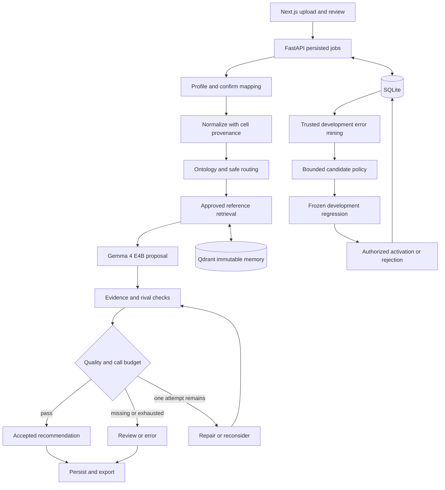

## 3. System and module contracts



### Proposed directory structure

Paths below are implementation targets relative to the real project repository, not files created by this planning task.

```text
backend/
  app/
    api/                 # datasets, jobs, predictions, review, evaluations, harness
    schemas/             # typed domain and HTTP contracts
    ingestion/           # safe workbook profiling and mapping
    normalization/       # Decimal, missingness, financial signal provenance
    routing/             # ontology-based candidates with broad fallback
    retrieval/           # encoder, eligible search, immutable memory build
    inference/           # Ollama adapter, prompts, shared attempt budget
    verification/        # deterministic evidence checks and quality policy
    harness/             # state machine, repair proposals, activation
    persistence/         # models, repositories, migrations, leases
    export/              # review JSON, strict JSON, enriched XLSX
  ontology/              # approved taxonomy and versioned boundary definitions
  tests/                 # unit, integration, fault and adversarial fixtures
  pyproject.toml
frontend/
  app/                   # upload, jobs, review, evaluations, harness, memory
  components/
  lib/                   # generated OpenAPI client and presentation helpers
evals/
  manifests/             # dataset hashes, grouped split IDs, label provenance
  fixtures/              # explicitly synthetic/non-sensitive contract cases
  scripts/               # baseline, ablation, robustness, promotion runner
  reports/               # real run outputs only; private data excluded
docs/
  decisions/             # short architecture decision records
  research-evidence.md   # paper -> module -> experiment -> measured artifact
  implementation-status.md
  runbook.md
storage/                 # private ignored uploads, database, exports, artifacts
compose.yaml
compose.gpu.yaml
.env.example
```

### Typed records

| Contract | Required semantics |
|---|---|
| `SourceRow` | Dataset ID, sheet, physical Excel row, raw cell types/values, source hash; invoice number is not a unique key |
| `SchemaMapping` | Explicit canonical-path-to-column mapping, sheet scope, row-unit policy, revision, approver; ambiguous mappings block jobs |
| `CanonicalTransaction` | Source references; document, parties, accounts/ownership, amounts/currency, inventory, tax and references only where observed; missingness and parse issues |
| `FinancialSignal` | Signal name, observed/derived status, source paths, derivation rule version; unknown is not negative evidence |
| `OntologyEntry` | Official ID/name, family, definition, inclusions, exclusions, rivals, evidence requirements, source and revision |
| `ModelProposal` | `proposed_label` or null, `top_alternative` or null, `evidence_paths`, `missing_evidence`, bounded `rationale_summary`; unknown fields forbidden |
| `Decision` | Proposed label, accepted/review/error state, reason codes, candidates, checked evidence, attempt count, trace and pinned bundle; confidence null until calibrated |
| `Review` | Prediction ID, expected revision, reviewer identity, corrected label, reason, authority/source, timestamp; immutable event |
| `HarnessBundle` | Model digest, runtime/settings, code commit, ontology/prompt hashes, encoder config, immutable memory ID, quality policy and evaluator manifest |

Use Decimal internally and decimal strings over JSON. Missing, zero, false and empty/invalid strings are distinct. Ambiguous `01/02/2026` cannot be resolved without a date policy. Do not equate debit/credit or the word `transfer` with fund direction or common ownership. A source field existing is insufficient: its value must support the claimed distinction. Free-text semantic relevance remains fallible; ambiguous support triggers review.

If the organizer defines a transaction as multiple invoice lines, introduce a grouped transaction ID with all source-row links and a documented export mapping. Do not silently merge rows by invoice number. Until G2 resolves, row-based fixtures are explicitly provisional.

### Persistence and consistency

Create migrations for datasets, source rows, mappings, jobs, job-row states, model attempts, predictions, candidates, traces, reviews, trusted labels, split manifests, evaluations/metrics, proposals/regressions, harness versions, activation events, model/embedding registries, memory snapshots, and exports.

- SQLite is authoritative; Qdrant is rebuildable. Enforce foreign keys and unique `(job_id, transaction_id)` final results.
- Keep inference outside database transactions. Claim work using a short transaction and lease; heartbeat during execution; recover expired leases after restart.
- Reserve an attempt durably **before** sending inference. A crash with unknown response consumes that attempt; do not exceed two by retrying invisibly.
- Snapshot mapping and harness at job creation. A new active harness affects new jobs only. Review/export revisions are explicit so re-export is reproducible.
- Build memory snapshots from immutable eligible case IDs/content hashes. Validate index contents before activation. Never mutate a collection used by an active job.
- There is no cross-database SQLite/Qdrant transaction. Prepare all artifacts first, then compare-and-swap the active SQLite pointer against the expected parent version.
- Retain all referenced bundle artifacts for rollback; garbage collection cannot remove versions used by running jobs or retained evidence.

### API plan

All endpoints are proposed. Implement versioned Pydantic schemas and generate the TypeScript client from OpenAPI after the backend exists.

| Method / route | Behavior |
|---|---|
| `POST /api/v1/datasets` | Stream bounded upload; validate; create dataset ID |
| `GET /api/v1/datasets/{id}/schema` | Sheets, headers, row scope, ambiguities, mapping candidates |
| `POST /api/v1/datasets/{id}/mapping` | Validate and version confirmed mapping |
| `POST /api/v1/jobs` | Idempotent request; pin inputs/configuration; return 202 + job ID |
| `GET /api/v1/jobs/{id}` | Counts, progress, errors, pinned version |
| `GET /api/v1/jobs/{id}/predictions` | Stable pagination/filtering/sorting |
| `GET /api/v1/predictions/{id}/trace` | Source evidence, stage outcomes, approved exemplar IDs |
| `POST /api/v1/predictions/{id}/review` | Authorized revision-checked label correction |
| `GET /api/v1/jobs/{id}/export?format=json&mode=review` | Complete review artifact; XLSX supported too |
| `GET /api/v1/jobs/{id}/export?format=json&mode=submission` | Validate organizer contract; return actionable blocker list if invalid |
| `POST /api/v1/evaluations` | Persist evaluation job for eligible split and specified variants |
| `GET /api/v1/evaluations/{id}` | Added endpoint: progress, support counts, metrics and artifacts |
| `GET /api/v1/harness/versions` | Immutable versions and lineage |
| `POST /api/v1/harness/proposals` | Sandboxed, allowlisted policy proposal |
| `POST /api/v1/harness/proposals/{id}/evaluate` | Evaluate against predeclared regression policy |
| `POST /api/v1/harness/versions/{id}/activate` | Authorized, evaluated, artifact-validated activation |
| `POST /api/v1/harness/versions/{id}/rollback` | Authorized restoration of complete eligible bundle |

Use typed errors such as `TAXONOMY_MISSING`, `MAPPING_AMBIGUOUS`, `MODEL_TIMEOUT`, `INVALID_MODEL_OUTPUT`, `EVIDENCE_UNSUPPORTED`, `BUDGET_EXHAUSTED`, `MEMORY_UNAVAILABLE`, `SUBMISSION_BLOCKED`, and `VERSION_CONFLICT`. UI must display human-readable reasons, not raw stack traces. Add health/readiness endpoints without making optional empty reference memory a startup failure.
